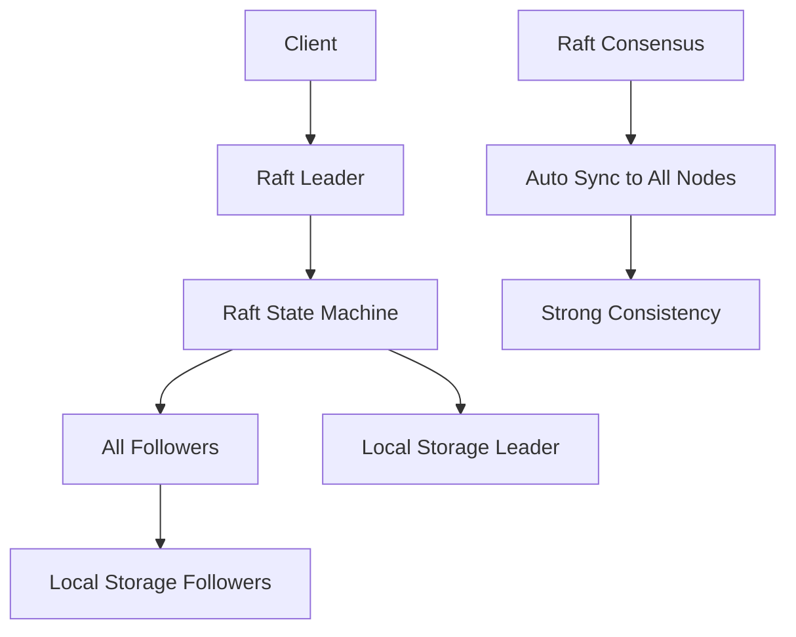

# 消息数据副本同步 (Message Replication)

## 概述

Go Queue 现在支持基于 **纯 Raft** 的消息数据副本同步功能！这个功能通过 Raft 共识算法确保消息数据在多个节点间保持强一致性，提供高可用性和数据安全保障。

## 🚀 核心特性

- **纯 Raft 副本同步**: 所有消息写入都通过 Raft 共识算法自动同步到所有节点
- **强一致性保证**: 基于 Raft 算法的强一致性，无需额外的 ISR 管理
- **自动故障转移**: Raft 自动处理 Leader 选举和节点故障
- **简化架构**: 去除传统 Kafka 的 ISR 机制，完全依赖 Raft 冗余
- **消息完整性**: 使用校验和确保消息完整性

## 🏗️ 架构设计

### 为什么选择纯 Raft 而不是 ISR？

1. **避免冗余**: Raft 本身就保证了数据在多数节点间的一致性，再用 ISR 是多余的
2. **简化复杂性**: 两套机制会增加系统复杂性和维护成本
3. **性能优化**: 避免额外的 ISR 监控和管理开销
4. **统一一致性**: Raft 提供了统一的一致性保证，无需额外机制

### 核心组件

1. **ClusterStateMachine**: Raft 状态机
   - 管理消息数据存储
   - 自动同步到所有节点
   - 处理消息写入操作

2. **Manager**: 集群管理器
   - 协调消息写入
   - 管理 Raft 节点
   - 提供统一的操作接口

### 数据流程



## 📋 实现细节

### 1. 消息写入流程

```go
// 1. 客户端发送消息到任何节点（自动路由到Leader）
producer.Send(ProduceMessage{
    Topic:     "my-topic",
    Partition: 0,
    Value:     []byte("Hello World"),
})

// 2. Raft Leader 处理消息写入
result := clusterManager.ProduceMessage(topic, partition, data)

// 3. 状态机处理消息，自动同步到所有节点
statemachine.appendMessage(operation)

// 4. 所有节点都会执行相同的操作，保证一致性
```

### 2. Raft 状态机

```go
// 消息存储结构
type ClusterStateMachine struct {
    messages map[string]map[int32][]*MessageEntry // topic -> partition -> messages  
    offsets  map[string]map[int32]int64           // topic -> partition -> nextOffset
    // ... 其他字段
}

// 消息写入（在所有节点上执行）
func (csm *ClusterStateMachine) appendMessage(op *Operation) ([]byte, error) {
    // 获取下一个offset
    nextOffset := csm.offsets[op.Topic][op.Partition]
    
    // 创建消息条目
    messageEntry := &MessageEntry{
        ID:        messageID,
        Topic:     op.Topic,
        Partition: op.Partition,
        Offset:    nextOffset,
        Data:      op.Data,
        Timestamp: timestamp,
        Checksum:  csm.calculateChecksum(op.Data),
    }
    
    // 存储消息（在所有节点执行）
    csm.messages[op.Topic][op.Partition] = append(
        csm.messages[op.Topic][op.Partition], messageEntry)
    csm.offsets[op.Topic][op.Partition] = nextOffset + 1
    
    // 写入本地存储
    csm.manager.WriteMessageDirect(op.Topic, op.Partition, op.Data, nextOffset)
    
    return result, nil
}
```

### 3. 简化的集群管理

```go
// 简化的消息生产
func (cm *Manager) ProduceMessage(topic string, partition int32, data []byte) (*ProduceResult, error) {
    if !cm.IsLeader() {
        return nil, fmt.Errorf("not the leader")
    }

    // 创建 Raft 操作
    op := &Operation{
        Type:      OpAppendMessage,
        Topic:     topic,
        Partition: partition,
        Data:      data,
        Timestamp: time.Now().UnixMilli(),
    }

    // 通过 Raft 提交（自动同步到所有节点）
    result, err := cm.nodeHost.SyncPropose(ctx, session, opData)
    return parseResult(result)
}
```

## 🔧 配置说明

### 集群配置

```json
{
  "cluster": {
    "enabled": true,
    "node_id": 1,
    "raft_address": "localhost:8001",
    "initial_members": [
      "localhost:8001",
      "localhost:8002", 
      "localhost:8003"
    ],
    "data_dir": "./raft-data/node1",
    "election_rtt": 10,
    "heartbeat_rtt": 1,
    "snapshot_entries": 10000
  }
}
```

### 主题配置

```go
// 创建带副本的主题（副本数 = Raft 节点数）
admin.CreateTopic(client.CreateTopicRequest{
    Name:       "replicated-topic",
    Partitions: 3,
    Replicas:   3, // 等于 Raft 集群节点数
})
```

## 📊 监控和优势

### Raft 自动提供的保证

- **强一致性**: 所有节点的数据严格一致
- **自动 Leader 选举**: 无需手动干预
- **故障自动恢复**: 节点恢复后自动同步
- **分区容错**: 只要多数节点在线就能工作

### 性能优势

1. **简化架构**: 无需维护 ISR 状态
2. **减少开销**: 无额外的副本监控
3. **统一机制**: 只有一套一致性保证
4. **自动化**: Raft 自动处理所有故障情况

## 🚦 故障处理

### 1. Leader 故障

- Raft 自动选举新的 Leader
- 客户端自动重连到新 Leader
- 数据保持完全一致

### 2. Follower 故障

- 故障节点不影响服务可用性
- 节点恢复后自动从 Leader 同步数据
- 无需手动干预

### 3. 网络分区

- 只有多数节点的分区可以继续服务
- 少数分区自动停止写入
- 网络恢复后自动重新同步

## 🎯 使用示例

### 基本使用

```bash
# 启动 3 节点 Raft 集群
./broker -config=configs/broker-cluster-node1.json &
./broker -config=configs/broker-cluster-node2.json &
./broker -config=configs/broker-cluster-node3.json &

# 运行副本同步示例
go run examples/message_replication/main.go
```

### 验证一致性

```bash
# 停止一个节点
kill $BROKER_PID_2

# 继续发送消息（应该仍然可以工作）
go run examples/message_replication/main.go

# 重启节点，数据自动同步
./broker -config=configs/broker-cluster-node2.json &
```

## 🔍 架构优势总结

### vs 传统 ISR 方式

| 特性 | 传统 ISR | 纯 Raft |
|------|----------|----------|
| 一致性保证 | 最终一致性 | 强一致性 |
| 复杂度 | 高（双重机制） | 低（单一机制） |
| 故障处理 | 手动/半自动 | 全自动 |
| 监控需求 | 需要监控 ISR | 无需额外监控 |
| 性能开销 | 双重开销 | 单一开销 |

### 设计哲学

1. **简单即美**: 一套机制解决所有问题
2. **避免重复**: 不在 Raft 之上再建一套副本机制
3. **自动化**: 让 Raft 处理所有故障和恢复
4. **一致性优先**: 强一致性比高性能更重要

## 🚧 注意事项

1. **写入延迟**: Raft 共识会增加写入延迟
2. **网络要求**: 需要稳定的网络连接
3. **节点数量**: 建议奇数个节点（3、5、7）
4. **存储要求**: 每个节点都存储完整数据

## 🔮 未来改进

- [ ] 读取优化（从本地读取）
- [ ] 压缩和快照优化
- [ ] 跨数据中心支持
- [ ] 动态集群成员管理

## 📚 相关文档

- [集群指南](CLUSTER_GUIDE.md)
- [消费者组](CONSUMER_GROUPS.md)
- [配置迁移](CONFIG_MIGRATION.md) 