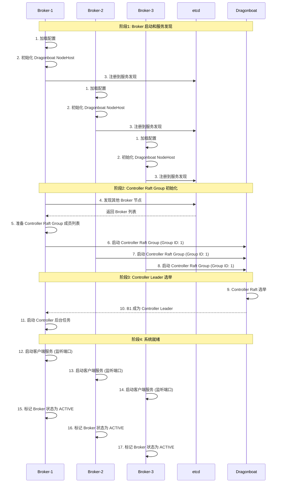
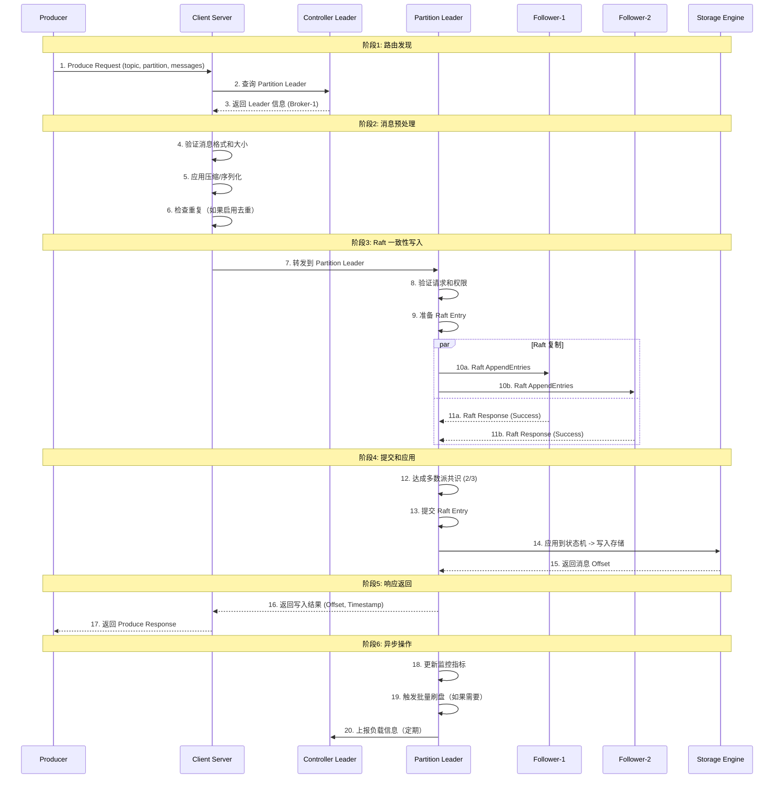
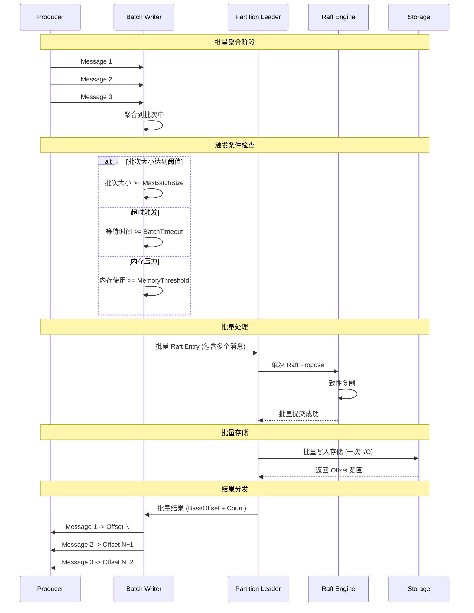

# Multi-Raft 消息队列系统架构设计与实现方案

## 整体架构概览

### 修正后的架构图

```
┌─────────────────────────────────────────────────────────────────┐
│                        Client Layer                             │
│  ┌─────────────┐  ┌─────────────┐  ┌─────────────┐              │
│  │ Producer 1  │  │ Producer 2  │  │ Consumer 1  │              │
│  └─────────────┘  └─────────────┘  └─────────────┘              │
└─────────────────────────────────────────────────────────────────┘
                              │
                              ▼
┌─────────────────────────────────────────────────────────────────┐
│                     Broker Cluster                             │
│                                                                 │
│  ┌─────────────────┐  ┌─────────────────┐  ┌─────────────────┐  │
│  │   Broker-1      │  │   Broker-2      │  │   Broker-3      │  │
│  │ ┌─────────────┐ │  │ ┌─────────────┐ │  │ ┌─────────────┐ │  │
│  │ │ Controller  │ │  │ │ Controller  │ │  │ │ Controller  │ │  │
│  │ │ (Leader)    │◄┼──┼►│ (Follower)  │◄┼──┼►│ (Follower)  │ │  │
│  │ └─────────────┘ │  │ └─────────────┘ │  │ └─────────────┘ │  │
│  │                 │  │                 │  │                 │  │
│  │ Multi-Raft Groups│ │ Multi-Raft Groups│ │ Multi-Raft Groups│ │
│  │ ┌─────────────┐ │  │ ┌─────────────┐ │  │ ┌─────────────┐ │  │
│  │ │Topic-A P0   │ │  │ │Topic-A P0   │ │  │ │Topic-A P1   │ │  │
│  │ │(Leader)     │◄┼──┼►│(Follower)   │◄┼──┼►│(Leader)     │ │  │
│  │ └─────────────┘ │  │ └─────────────┘ │  │ └─────────────┘ │  │
│  │ ┌─────────────┐ │  │ ┌─────────────┐ │  │ ┌─────────────┐ │  │
│  │ │Topic-B P0   │ │  │ │Topic-B P1   │ │  │ │Topic-B P0   │ │  │
│  │ │(Follower)   │◄┼──┼►│(Leader)     │◄┼──┼►│(Follower)   │ │  │
│  │ └─────────────┘ │  │ └─────────────┘ │  │ └─────────────┘ │  │
│  │                 │  │                 │  │                 │  │
│  │ Dragonboat      │  │ Dragonboat      │  │ Dragonboat      │  │
│  │ NodeHost        │  │ NodeHost        │  │ NodeHost        │  │
│  └─────────────────┘  └─────────────────┘  └─────────────────┘  │
└─────────────────────────────────────────────────────────────────┘
```

### 核心设计原则

1. **Controller 作为 Broker 角色**：每个 Broker 都包含 Controller 功能，通过 Raft 选举产生 Controller Leader
2. **双层 Raft 架构**：
   - **Controller Raft Group**：管理集群元数据，每个 Broker 都是成员
   - **Partition Raft Groups**：管理具体数据，分布在不同 Broker 上
3. **统一的 Dragonboat 引擎**：每个 Broker 使用一个 Dragonboat NodeHost 管理所有 Raft Groups

## 详细架构设计

### 1. 系统分层架构

```
┌─────────────────────────────────────────────────────────────────┐
│                     Application Layer                          │
│  ┌─────────────┐  ┌─────────────┐  ┌─────────────┐              │
│  │   Client    │  │  Admin CLI  │  │   Monitor   │              │
│  │     SDK     │  │    Tools    │  │  Dashboard  │              │
│  └─────────────┘  └─────────────┘  └─────────────┘              │
└─────────────────────────────────────────────────────────────────┘
                              │
                              ▼
┌─────────────────────────────────────────────────────────────────┐
│                    Protocol Layer                              │
│  ┌─────────────┐  ┌─────────────┐  ┌─────────────┐              │
│  │   Produce   │  │    Fetch    │  │    Admin    │              │
│  │  Protocol   │  │  Protocol   │  │  Protocol   │              │
│  └─────────────┘  └─────────────┘  └─────────────┘              │
└─────────────────────────────────────────────────────────────────┘
                              │
                              ▼
┌─────────────────────────────────────────────────────────────────┐
│                   Broker Layer                                 │
│  ┌─────────────┐  ┌─────────────┐  ┌─────────────┐              │
│  │ Controller  │  │ Partition   │  │   Client    │              │
│  │  Manager    │  │  Manager    │  │   Server    │              │
│  └─────────────┘  └─────────────┘  └─────────────┘              │
└─────────────────────────────────────────────────────────────────┘
                              │
                              ▼
┌─────────────────────────────────────────────────────────────────┐
│                 Consensus Layer (Dragonboat)                   │
│  ┌─────────────┐  ┌─────────────┐  ┌─────────────┐              │
│  │ Controller  │  │ Partition   │  │     ...     │              │
│  │ Raft Group  │  │Raft Groups  │  │ More Groups │              │
│  │  (Group 1)  │  │(Group 2-N)  │  │             │              │
│  └─────────────┘  └─────────────┘  └─────────────┘              │
└─────────────────────────────────────────────────────────────────┘
                              │
                              ▼
┌─────────────────────────────────────────────────────────────────┐
│                    Storage Layer                               │
│  ┌─────────────┐  ┌─────────────┐  ┌─────────────┐              │
│  │  Metadata   │  │  Partition  │  │    Index    │              │
│  │   Storage   │  │   Storage   │  │   Storage   │              │
│  └─────────────┘  └─────────────┘  └─────────────┘              │
└─────────────────────────────────────────────────────────────────┘
                              │
                              ▼
┌─────────────────────────────────────────────────────────────────┐
│                   Infrastructure Layer                         │
│  ┌─────────────┐  ┌─────────────┐  ┌─────────────┐              │
│  │  Service    │  │   Network   │  │   Metrics   │              │
│  │ Discovery   │  │    Layer    │  │ & Logging   │              │
│  │ (etcd/consul)│ │   (TCP/gRPC)│  │(Prometheus) │              │
│  └─────────────┘  └─────────────┘  └─────────────┘              │
└─────────────────────────────────────────────────────────────────┘
```

### 2. Raft Groups 分布示例

```
Controller Raft Group (Group ID: 1)
┌─────────────┐    ┌─────────────┐    ┌─────────────┐
│  Broker-1   │    │  Broker-2   │    │  Broker-3   │
│ Controller  │◄──►│ Controller  │◄──►│ Controller  │
│  (Leader)   │    │ (Follower)  │    │ (Follower)  │
└─────────────┘    └─────────────┘    └─────────────┘

Topic-A Partition-0 Raft Group (Group ID: 100)
┌─────────────┐    ┌─────────────┐    ┌─────────────┐
│  Broker-1   │    │  Broker-2   │    │  Broker-3   │
│   Leader    │◄──►│  Follower   │◄──►│  Follower   │
└─────────────┘    └─────────────┘    └─────────────┘

Topic-A Partition-1 Raft Group (Group ID: 101)
┌─────────────┐    ┌─────────────┐    ┌─────────────┐
│  Broker-1   │    │  Broker-2   │    │  Broker-3   │
│  Follower   │◄──►│  Follower   │◄──►│   Leader    │
└─────────────┘    └─────────────┘    └─────────────┘

Topic-B Partition-0 Raft Group (Group ID: 200)
┌─────────────┐    ┌─────────────┐    ┌─────────────┐
│  Broker-1   │    │  Broker-2   │    │  Broker-3   │
│  Follower   │◄──►│   Leader    │◄──►│  Follower   │
└─────────────┘    └─────────────┘    └─────────────┘
```

## 系统初始化流程

### 初始化序列图



### 详细初始化步骤

#### 阶段1: Broker 基础初始化
```go
func (b *Broker) Start() error {
    // 1. 加载和验证配置
    if err := b.loadAndValidateConfig(); err != nil {
        return fmt.Errorf("config validation failed: %v", err)
    }
    
    // 2. 初始化日志系统
    if err := b.initLogging(); err != nil {
        return fmt.Errorf("logging init failed: %v", err)
    }
    
    // 3. 创建数据目录
    if err := b.createDataDirectories(); err != nil {
        return fmt.Errorf("data directory creation failed: %v", err)
    }
    
    // 4. 初始化 Dragonboat NodeHost
    if err := b.initDragonboat(); err != nil {
        return fmt.Errorf("dragonboat init failed: %v", err)
    }
    
    // 5. 初始化服务发现
    if err := b.initServiceDiscovery(); err != nil {
        return fmt.Errorf("service discovery init failed: %v", err)
    }
    
    // 6. 注册到服务发现
    if err := b.registerBroker(); err != nil {
        return fmt.Errorf("broker registration failed: %v", err)
    }
    
    return nil
}
```

#### 阶段2: Controller Raft Group 初始化
```go
func (b *Broker) initController() error {
    // 1. 发现其他 Broker 节点
    brokers, err := b.discovery.DiscoverBrokers()
    if err != nil {
        return fmt.Errorf("broker discovery failed: %v", err)
    }
    
    // 2. 准备 Controller Raft Group 成员
    members := make(map[uint64]string)
    for _, broker := range brokers {
        nodeID, _ := strconv.ParseUint(broker.ID, 10, 64)
        members[nodeID] = broker.RaftAddress
    }
    
    // 3. 创建 Controller 状态机
    sm := &ControllerStateMachine{
        manager:  b.Controller,
        metadata: NewClusterMetadata(),
    }
    
    // 4. 启动 Controller Raft Group
    err = b.raftManager.StartRaftGroup(
        ControllerGroupID,
        members,
        sm,
    )
    if err != nil {
        return fmt.Errorf("controller raft group start failed: %v", err)
    }
    
    // 5. 等待 Raft Group 就绪
    return b.waitForControllerReady(30 * time.Second)
}
```

#### 阶段3: 负载现有数据
```go
func (b *Broker) loadExistingData() error {
    // 1. 扫描数据目录
    partitionDirs, err := b.scanPartitionDirectories()
    if err != nil {
        return err
    }
    
    // 2. 恢复 Partition Raft Groups
    for _, partitionDir := range partitionDirs {
        assignment, err := b.loadPartitionAssignment(partitionDir)
        if err != nil {
            log.Printf("Failed to load partition %s: %v", partitionDir, err)
            continue
        }
        
        // 重启 Partition Raft Group
        if err := b.PartitionManager.RestorePartition(assignment); err != nil {
            log.Printf("Failed to restore partition %s: %v", assignment.TopicName, err)
            continue
        }
    }
    
    return nil
}
```

## 消息写入流程

### 写入序列图



### 批量写入优化流程



### 详细写入实现

#### 1. 消息路由和验证
```go
func (cs *ClientServer) HandleProduceRequest(req *ProduceRequest) (*ProduceResponse, error) {
    // 1. 查找 Partition Leader
    leader, err := cs.broker.Controller.GetPartitionLeader(req.Topic, req.Partition)
    if err != nil {
        return nil, fmt.Errorf("partition leader not found: %v", err)
    }
    
    // 2. 如果当前 Broker 是 Leader，直接处理
    if leader == cs.broker.ID {
        return cs.handleLocalProduce(req)
    }
    
    // 3. 否则转发到 Leader Broker
    return cs.forwardToLeader(req, leader)
}

func (cs *ClientServer) handleLocalProduce(req *ProduceRequest) (*ProduceResponse, error) {
    // 1. 获取 Partition
    partition, err := cs.broker.PartitionManager.GetPartition(req.Topic, req.Partition)
    if err != nil {
        return nil, err
    }
    
    // 2. 验证 Partition Leader 状态
    if !partition.IsLeader.Load() {
        return nil, errors.New("not partition leader")
    }
    
    // 3. 验证消息
    for _, msg := range req.Messages {
        if len(msg) > MaxMessageSize {
            return nil, fmt.Errorf("message too large: %d bytes", len(msg))
        }
    }
    
    // 4. 写入消息
    return partition.Writer.Write(context.Background(), req.Messages)
}
```

#### 2. Raft 写入处理
```go
func (pw *PartitionWriter) Write(ctx context.Context, messages [][]byte) (*ProduceResponse, error) {
    // 1. 准备批量写入
    batch := &MessageBatch{
        Messages:  make([]*ProduceMessage, len(messages)),
        Timestamp: time.Now(),
    }
    
    for i, msg := range messages {
        batch.Messages[i] = &ProduceMessage{
            Data:      msg,
            Timestamp: batch.Timestamp,
        }
    }
    
    // 2. 序列化为 Raft Entry
    entryData, err := json.Marshal(batch)
    if err != nil {
        return nil, err
    }
    
    // 3. 提交到 Raft
    result, err := pw.partition.raftManager.SyncPropose(
        ctx,
        pw.partition.RaftGroupID,
        entryData,
    )
    if err != nil {
        return nil, fmt.Errorf("raft propose failed: %v", err)
    }
    
    // 4. 解析结果
    var writeResult BatchWriteResult
    if err := json.Unmarshal(result.Data, &writeResult); err != nil {
        return nil, err
    }
    
    // 5. 构造响应
    return &ProduceResponse{
        BaseOffset: writeResult.BaseOffset,
        ErrorCode:  0,
    }, nil
}
```

#### 3. 状态机应用
```go
func (psm *PartitionStateMachine) Update(entries []sm.Entry) ([]sm.Entry, error) {
    results := make([]sm.Entry, len(entries))
    
    for i, entry := range entries {
        // 1. 解析消息批次
        var batch MessageBatch
        if err := json.Unmarshal(entry.Cmd, &batch); err != nil {
            results[i] = sm.Entry{Result: sm.Result{Value: 0}}
            continue
        }
        
        // 2. 批量写入存储
        baseOffset, err := psm.storage.BatchAppend(&batch)
        if err != nil {
            results[i] = sm.Entry{Result: sm.Result{Value: 0}}
            continue
        }
        
        // 3. 更新索引
        psm.updateIndices(&batch, baseOffset)
        
        // 4. 返回结果
        result := BatchWriteResult{
            BaseOffset:   baseOffset,
            MessageCount: len(batch.Messages),
            Timestamp:    batch.Timestamp,
        }
        
        resultData, _ := json.Marshal(result)
        results[i] = sm.Entry{
            Result: sm.Result{
                Value: uint64(len(resultData)),
                Data:  resultData,
            },
        }
    }
    
    return results, nil
}
```

### 性能优化策略

#### 1. 写入路径优化
```go
type WriteOptimizer struct {
    // 批量配置
    batchConfig     *BatchConfig
    
    // 自适应调整
    adaptiveBatcher *AdaptiveBatcher
    
    // 内存管理
    memoryPool     *sync.Pool
    bufferPool     *sync.Pool
    
    // 指标收集
    metrics        *WriteMetrics
}

func (wo *WriteOptimizer) OptimizeBatch(batch *MessageBatch) *MessageBatch {
    // 1. 压缩优化
    if wo.shouldCompress(batch) {
        compressed := wo.compressBatch(batch)
        if wo.compressionBeneficial(batch, compressed) {
            return compressed
        }
    }
    
    // 2. 序列化优化
    wo.optimizeSerialization(batch)
    
    // 3. 内存对齐
    wo.alignMemory(batch)
    
    return batch
}
```

#### 2. 存储写入优化
```go
func (ps *PartitionStorage) BatchAppend(batch *MessageBatch) (int64, error) {
    ps.mu.Lock()
    defer ps.mu.Unlock()
    
    // 1. 预分配空间
    totalSize := ps.calculateBatchSize(batch)
    if err := ps.ensureCapacity(totalSize); err != nil {
        return 0, err
    }
    
    // 2. 准备写入缓冲区
    buffer := ps.getWriteBuffer(totalSize)
    defer ps.putWriteBuffer(buffer)
    
    // 3. 序列化消息到缓冲区
    baseOffset := ps.nextOffset
    for _, msg := range batch.Messages {
        ps.serializeMessage(buffer, msg, baseOffset)
        baseOffset++
    }
    
    // 4. 原子写入
    if err := ps.atomicWrite(buffer); err != nil {
        return 0, err
    }
    
    // 5. 更新元数据
    ps.updateMetadata(batch, baseOffset)
    
    return ps.nextOffset, nil
}
```

## 核心组件设计

### 1. Broker 架构

```go
// Broker 是系统的核心节点，集成了所有功能
type Broker struct {
    // 基础信息
    ID       string
    Address  string
    Port     int
    
    // Dragonboat 引擎
    NodeHost *dragonboat.NodeHost
    
    // Controller 功能
    Controller *ControllerManager
    
    // 分区管理
    PartitionManager *PartitionManager
    
    // 客户端服务
    ClientServer *ClientServer
    
    // 配置
    Config *BrokerConfig
    
    // 生命周期管理
    ctx    context.Context
    cancel context.CancelFunc
    wg     sync.WaitGroup
}

type BrokerConfig struct {
    // 节点配置
    NodeID   string `json:"node_id"`
    BindAddr string `json:"bind_addr"`
    BindPort int    `json:"bind_port"`
    
    // 数据目录
    DataDir string `json:"data_dir"`
    
    // Raft 配置
    RaftConfig *RaftConfig `json:"raft_config"`
    
    // 集群发现配置
    Discovery *DiscoveryConfig `json:"discovery"`
    
    // 性能调优
    Performance *PerformanceConfig `json:"performance"`
}

type RaftConfig struct {
    // Dragonboat 配置
    RTTMillisecond         uint64 `json:"rtt_millisecond"`
    HeartbeatRTT           uint64 `json:"heartbeat_rtt"`
    ElectionRTT            uint64 `json:"election_rtt"`
    CheckQuorum            bool   `json:"check_quorum"`
    SnapshotEntries        uint64 `json:"snapshot_entries"`
    CompactionOverhead     uint64 `json:"compaction_overhead"`
    MaxInMemLogSize        uint64 `json:"max_in_mem_log_size"`
    
    // 控制器特定配置
    ControllerGroupID      uint64 `json:"controller_group_id"`
    ControllerSnapshotFreq uint64 `json:"controller_snapshot_freq"`
}
```

### 2. Controller 管理器

```go
// ControllerManager 管理 Controller 相关功能
type ControllerManager struct {
    broker     *Broker
    
    // Raft 状态
    isLeader   atomic.Bool
    leaderID   atomic.Value // string
    
    // 元数据管理
    metadata   *ClusterMetadata
    
    // 调度器
    scheduler  *LeaderScheduler
    monitor    *LoadMonitor
    
    // 故障检测
    failureDetector *FailureDetector
    
    // 同步互斥
    mu sync.RWMutex
}

// ClusterMetadata 存储在 Controller Raft Group 中
type ClusterMetadata struct {
    // 集群信息
    ClusterID string                    `json:"cluster_id"`
    Brokers   map[string]*BrokerInfo    `json:"brokers"`
    
    // Topic 和 Partition 信息
    Topics              map[string]*TopicMetadata      `json:"topics"`
    PartitionAssignments map[string]*PartitionAssignment `json:"partition_assignments"`
    
    // Leader 分配
    LeaderAssignments map[string]string `json:"leader_assignments"` // PartitionID -> BrokerID
    
    // 版本信息
    Version    int64     `json:"version"`
    UpdateTime time.Time `json:"update_time"`
}

type BrokerInfo struct {
    ID       string    `json:"id"`
    Address  string    `json:"address"`
    Port     int       `json:"port"`
    Status   string    `json:"status"` // "active", "draining", "failed"
    
    // 负载信息
    LoadMetrics *LoadMetrics `json:"load_metrics"`
    LastSeen    time.Time    `json:"last_seen"`
    
    // Raft 成员信息
    RaftAddress string `json:"raft_address"`
    RaftPort    int    `json:"raft_port"`
}

type TopicMetadata struct {
    Name            string    `json:"name"`
    Partitions      int32     `json:"partitions"`
    ReplicationFactor int32   `json:"replication_factor"`
    CreatedAt       time.Time `json:"created_at"`
    Config          map[string]string `json:"config"`
}

type PartitionAssignment struct {
    TopicName     string   `json:"topic_name"`
    PartitionID   int32    `json:"partition_id"`
    RaftGroupID   uint64   `json:"raft_group_id"`
    Replicas      []string `json:"replicas"`      // Broker IDs
    Leader        string   `json:"leader"`        // Current leader broker
    ISR           []string `json:"isr"`           // In-Sync Replicas (Raft 自动管理)
    PreferredLeader string `json:"preferred_leader"` // Controller 指定的首选 Leader
}
```

### 3. Controller Raft 状态机

```go
// ControllerStateMachine 实现 Dragonboat 状态机接口
type ControllerStateMachine struct {
    manager  *ControllerManager
    metadata *ClusterMetadata
    mu       sync.RWMutex
}

func (csm *ControllerStateMachine) Update(entries []sm.Entry) ([]sm.Entry, error) {
    results := make([]sm.Entry, len(entries))
    
    for i, entry := range entries {
        var cmd ControllerCommand
        if err := json.Unmarshal(entry.Cmd, &cmd); err != nil {
            results[i] = sm.Entry{Result: sm.Result{Value: 0}}
            continue
        }
        
        result, err := csm.executeCommand(&cmd)
        if err != nil {
            results[i] = sm.Entry{Result: sm.Result{Value: 0}}
            continue
        }
        
        resultData, _ := json.Marshal(result)
        results[i] = sm.Entry{
            Result: sm.Result{
                Value: uint64(len(resultData)),
                Data:  resultData,
            },
        }
    }
    
    return results, nil
}

type ControllerCommand struct {
    Type      string                 `json:"type"`
    ID        string                 `json:"id"`
    Timestamp time.Time              `json:"timestamp"`
    Data      map[string]interface{} `json:"data"`
}

func (csm *ControllerStateMachine) executeCommand(cmd *ControllerCommand) (interface{}, error) {
    csm.mu.Lock()
    defer csm.mu.Unlock()
    
    switch cmd.Type {
    case "register_broker":
        return csm.registerBroker(cmd.Data)
    case "unregister_broker":
        return csm.unregisterBroker(cmd.Data)
    case "create_topic":
        return csm.createTopic(cmd.Data)
    case "delete_topic":
        return csm.deleteTopic(cmd.Data)
    case "migrate_leader":
        return csm.migrateLeader(cmd.Data)
    case "update_partition_assignment":
        return csm.updatePartitionAssignment(cmd.Data)
    default:
        return nil, fmt.Errorf("unknown command type: %s", cmd.Type)
    }
}

// Controller 领导权回调
func (cm *ControllerManager) OnBecomeLeader() {
    cm.isLeader.Store(true)
    cm.leaderID.Store(cm.broker.ID)
    
    log.Printf("Broker %s became Controller leader", cm.broker.ID)
    
    // 启动 Controller 任务
    go cm.startLeaderTasks()
}

func (cm *ControllerManager) OnLoseLeadership() {
    cm.isLeader.Store(false)
    
    log.Printf("Broker %s lost Controller leadership", cm.broker.ID)
    
    // 停止 Controller 任务
    cm.stopLeaderTasks()
}

func (cm *ControllerManager) startLeaderTasks() {
    // 1. 启动负载监控
    go cm.monitor.StartMonitoring()
    
    // 2. 启动故障检测
    go cm.failureDetector.StartDetection()
    
    // 3. 启动 Leader 调度
    go cm.scheduler.StartScheduling()
    
    // 4. 执行一次完整的健康检查
    go cm.performFullHealthCheck()
}
```

### 4. 分区管理器

```go
// PartitionManager 管理单个 Broker 上的所有 Partition
type PartitionManager struct {
    broker       *Broker
    partitions   map[string]*PartitionRaftGroup
    mu           sync.RWMutex
    
    // 分区创建和删除
    createChan   chan *PartitionCreateRequest
    deleteChan   chan *PartitionDeleteRequest
}

type PartitionRaftGroup struct {
    // 基础信息
    TopicName     string
    PartitionID   int32
    RaftGroupID   uint64
    
    // Raft 状态
    IsLeader      atomic.Bool
    Members       []string
    
    // 存储引擎
    Storage       *PartitionStorage
    
    // 读写组件
    Writer        *PartitionWriter
    Reader        *PartitionReader
    
    // 指标统计
    Metrics       *PartitionMetrics
    
    // 同步
    mu            sync.RWMutex
}

type PartitionStorage struct {
    // 文件存储
    dataDir       string
    segmentMgr    *SegmentManager
    
    // 索引
    offsetIndex   *OffsetIndex
    timeIndex     *TimeIndex
    
    // 缓存
    writeCache    *WriteCache
    readCache     *ReadCache
    
    // 配置
    config        *StorageConfig
}

// Partition Raft 状态机
type PartitionStateMachine struct {
    partition *PartitionRaftGroup
    storage   *PartitionStorage
}

func (psm *PartitionStateMachine) Update(entries []sm.Entry) ([]sm.Entry, error) {
    results := make([]sm.Entry, len(entries))
    
    // 批量处理消息写入
    batch := &MessageBatch{
        Messages: make([]*ProduceMessage, 0, len(entries)),
    }
    
    for _, entry := range entries {
        var msg ProduceMessage
        if err := json.Unmarshal(entry.Cmd, &msg); err != nil {
            continue
        }
        batch.Messages = append(batch.Messages, &msg)
    }
    
    // 批量写入存储
    offsets, err := psm.storage.BatchAppend(batch)
    if err != nil {
        // 处理错误
        for i := range results {
            results[i] = sm.Entry{Result: sm.Result{Value: 0}}
        }
        return results, err
    }
    
    // 返回结果
    for i, offset := range offsets {
        offsetData, _ := json.Marshal(offset)
        results[i] = sm.Entry{
            Result: sm.Result{
                Value: uint64(len(offsetData)),
                Data:  offsetData,
            },
        }
    }
    
    return results, nil
}
```

## 实现步骤

### 阶段 1：基础框架搭建 (2-3 周)

#### 1.1 项目结构重构
```
go-queue/
├── cmd/
│   └── broker/           # Broker 启动入口
├── internal/
│   ├── broker/           # Broker 核心逻辑
│   │   ├── broker.go
│   │   ├── controller.go
│   │   └── partition.go
│   ├── raft/             # Raft 封装层
│   │   ├── controller_sm.go
│   │   ├── partition_sm.go
│   │   └── raft_manager.go
│   ├── storage/          # 存储层 (保持现有)
│   ├── protocol/         # 协议层 (保持现有)
│   └── discovery/        # 服务发现
│       ├── etcd.go
│       └── consul.go
├── configs/              # 配置文件
└── pkg/                  # 公共库
    ├── types/
    └── utils/
```

#### 1.2 基础组件实现

**任务 1.2.1：Dragonboat 集成**
```go
// 实现 Dragonboat 封装
type RaftManager struct {
    nodeHost *dragonboat.NodeHost
    config   *RaftConfig
}

func NewRaftManager(config *RaftConfig) (*RaftManager, error) {
    // 1. 创建 Dragonboat NodeHost 配置
    nhConfig := dragonboat.Config{
        NodeID:             config.NodeID,
        ClusterID:          config.ClusterID,
        RTTMillisecond:     config.RTTMillisecond,
        HeartbeatRTT:       config.HeartbeatRTT,
        ElectionRTT:        config.ElectionRTT,
        CheckQuorum:        config.CheckQuorum,
        SnapshotEntries:    config.SnapshotEntries,
        CompactionOverhead: config.CompactionOverhead,
    }
    
    // 2. 创建 NodeHost
    nodeHost, err := dragonboat.NewNodeHost(nhConfig)
    if err != nil {
        return nil, err
    }
    
    return &RaftManager{
        nodeHost: nodeHost,
        config:   config,
    }, nil
}
```

**任务 1.2.2：服务发现集成**
```go
// 基于 etcd 的服务发现
type EtcdDiscovery struct {
    client   *clientv3.Client
    prefix   string
    lease    clientv3.Lease
    leaseID  clientv3.LeaseID
}

func (ed *EtcdDiscovery) RegisterBroker(broker *BrokerInfo) error {
    // 1. 创建租约
    lease, err := ed.client.Grant(context.Background(), 30)
    if err != nil {
        return err
    }
    
    // 2. 注册 Broker 信息
    key := fmt.Sprintf("%s/brokers/%s", ed.prefix, broker.ID)
    data, _ := json.Marshal(broker)
    _, err = ed.client.Put(context.Background(), key, string(data), clientv3.WithLease(lease.ID))
    if err != nil {
        return err
    }
    
    // 3. 启动续约
    ch, kaerr := ed.client.KeepAlive(context.Background(), lease.ID)
    if kaerr != nil {
        return kaerr
    }
    
    go func() {
        for ka := range ch {
            // 处理续约响应
            log.Printf("Lease %d renewed", ka.ID)
        }
    }()
    
    ed.leaseID = lease.ID
    return nil
}
```

**任务 1.2.3：基础 Broker 框架**
```go
func (b *Broker) Start() error {
    // 1. 初始化 Dragonboat
    if err := b.initRaft(); err != nil {
        return err
    }
    
    // 2. 启动服务发现
    if err := b.initDiscovery(); err != nil {
        return err
    }
    
    // 3. 启动 Controller
    if err := b.startController(); err != nil {
        return err
    }
    
    // 4. 启动客户端服务
    if err := b.startClientServer(); err != nil {
        return err
    }
    
    log.Printf("Broker %s started successfully", b.ID)
    return nil
}
```

### 阶段 2：Controller 实现 (3-4 周)

#### 2.1 Controller Raft Group 实现

**任务 2.1.1：Controller 状态机**
```go
// 实现完整的 Controller 状态机
func (csm *ControllerStateMachine) createTopic(data map[string]interface{}) (interface{}, error) {
    // 1. 解析创建请求
    topicName := data["topic_name"].(string)
    partitions := int32(data["partitions"].(float64))
    replicationFactor := int32(data["replication_factor"].(float64))
    
    // 2. 验证请求
    if _, exists := csm.metadata.Topics[topicName]; exists {
        return nil, fmt.Errorf("topic %s already exists", topicName)
    }
    
    // 3. 分配分区
    assignments, err := csm.allocatePartitions(topicName, partitions, replicationFactor)
    if err != nil {
        return nil, err
    }
    
    // 4. 更新元数据
    topic := &TopicMetadata{
        Name:              topicName,
        Partitions:        partitions,
        ReplicationFactor: replicationFactor,
        CreatedAt:         time.Now(),
        Config:            make(map[string]string),
    }
    
    csm.metadata.Topics[topicName] = topic
    
    for _, assignment := range assignments {
        partitionKey := fmt.Sprintf("%s-%d", topicName, assignment.PartitionID)
        csm.metadata.PartitionAssignments[partitionKey] = assignment
        csm.metadata.LeaderAssignments[partitionKey] = assignment.Leader
    }
    
    csm.metadata.Version++
    csm.metadata.UpdateTime = time.Now()
    
    return assignments, nil
}
```

**任务 2.1.2：Leader 选举和角色管理**
```go
func (cm *ControllerManager) handleLeadershipChange(isLeader bool) {
    if isLeader {
        cm.OnBecomeLeader()
    } else {
        cm.OnLoseLeadership()
    }
}

func (cm *ControllerManager) IsLeader() bool {
    return cm.isLeader.Load()
}

func (cm *ControllerManager) GetLeaderID() string {
    if leaderID := cm.leaderID.Load(); leaderID != nil {
        return leaderID.(string)
    }
    return ""
}
```

#### 2.2 分区分配算法

**任务 2.2.1：实现 Round-Robin 分配器**
```go
type RoundRobinAssigner struct {
    metadata *ClusterMetadata
}

func (rra *RoundRobinAssigner) AllocatePartitions(
    topicName string, 
    partitions int32, 
    replicationFactor int32,
) ([]*PartitionAssignment, error) {
    
    // 1. 获取可用 Broker
    availableBrokers := rra.getAvailableBrokers()
    if len(availableBrokers) < int(replicationFactor) {
        return nil, fmt.Errorf("insufficient brokers: need %d, have %d", 
            replicationFactor, len(availableBrokers))
    }
    
    assignments := make([]*PartitionAssignment, partitions)
    
    for i := int32(0); i < partitions; i++ {
        assignment := &PartitionAssignment{
            TopicName:     topicName,
            PartitionID:   i,
            RaftGroupID:   rra.generateRaftGroupID(topicName, i),
            Replicas:      make([]string, replicationFactor),
        }
        
        // 2. 选择 Leader（Round-Robin）
        leaderIndex := int(i) % len(availableBrokers)
        assignment.Leader = availableBrokers[leaderIndex].ID
        assignment.PreferredLeader = availableBrokers[leaderIndex].ID
        assignment.Replicas[0] = availableBrokers[leaderIndex].ID
        
        // 3. 选择 Followers（尽量分散）
        for j := int32(1); j < replicationFactor; j++ {
            followerIndex := (leaderIndex + int(j)) % len(availableBrokers)
            assignment.Replicas[j] = availableBrokers[followerIndex].ID
        }
        
        assignment.ISR = assignment.Replicas // 初始时所有副本都在 ISR 中
        assignments[i] = assignment
    }
    
    return assignments, nil
}
```

### 阶段 3：Partition Raft Groups (4-5 周)

#### 3.1 Partition 生命周期管理

**任务 3.1.1：Partition 创建和销毁**
```go
func (pm *PartitionManager) CreatePartition(assignment *PartitionAssignment) error {
    partitionKey := fmt.Sprintf("%s-%d", assignment.TopicName, assignment.PartitionID)
    
    // 1. 检查是否已存在
    if _, exists := pm.partitions[partitionKey]; exists {
        return fmt.Errorf("partition %s already exists", partitionKey)
    }
    
    // 2. 创建存储目录
    dataDir := filepath.Join(pm.broker.Config.DataDir, "partitions", partitionKey)
    if err := os.MkdirAll(dataDir, 0755); err != nil {
        return err
    }
    
    // 3. 创建 Partition 实例
    partition := &PartitionRaftGroup{
        TopicName:   assignment.TopicName,
        PartitionID: assignment.PartitionID,
        RaftGroupID: assignment.RaftGroupID,
        Members:     assignment.Replicas,
        Storage:     NewPartitionStorage(dataDir),
        Writer:      NewPartitionWriter(),
        Reader:      NewPartitionReader(),
        Metrics:     NewPartitionMetrics(),
    }
    
    // 4. 启动 Raft Group
    err := pm.broker.raftManager.StartRaftGroup(
        assignment.RaftGroupID,
        assignment.Replicas,
        &PartitionStateMachine{partition: partition},
    )
    if err != nil {
        return err
    }
    
    // 5. 注册到管理器
    pm.mu.Lock()
    pm.partitions[partitionKey] = partition
    pm.mu.Unlock()
    
    log.Printf("Partition %s created successfully", partitionKey)
    return nil
}
```

**任务 3.1.2：Partition 状态机优化**
```go
// 实现批量写入优化
func (psm *PartitionStateMachine) BatchUpdate(entries []sm.Entry) ([]sm.Entry, error) {
    if len(entries) == 0 {
        return nil, nil
    }
    
    // 1. 解析所有消息
    messages := make([]*ProduceMessage, 0, len(entries))
    for _, entry := range entries {
        var msg ProduceMessage
        if err := json.Unmarshal(entry.Cmd, &msg); err == nil {
            messages = append(messages, &msg)
        }
    }
    
    // 2. 批量写入存储
    batch := &MessageBatch{
        Messages:  messages,
        Timestamp: time.Now(),
    }
    
    offsets, err := psm.storage.BatchAppend(batch)
    if err != nil {
        return psm.createErrorResults(len(entries)), err
    }
    
    // 3. 构造返回结果
    results := make([]sm.Entry, len(entries))
    for i, offset := range offsets {
        if i < len(results) {
            offsetData, _ := json.Marshal(WriteResult{
                Offset:    offset,
                Timestamp: batch.Timestamp,
            })
            results[i] = sm.Entry{
                Result: sm.Result{
                    Value: uint64(len(offsetData)),
                    Data:  offsetData,
                },
            }
        }
    }
    
    return results, nil
}
```

#### 3.2 读写性能优化

**任务 3.2.1：写入优化**
```go
type PartitionWriter struct {
    partition    *PartitionRaftGroup
    batchConfig  *BatchConfig
    pendingBatch *MessageBatch
    batchTimer   *time.Timer
    mu           sync.Mutex
}

type BatchConfig struct {
    MaxBatchSize    int
    MaxBatchBytes   int64
    BatchTimeout    time.Duration
    CompressionType string
}

func (pw *PartitionWriter) Write(ctx context.Context, messages []*ProduceMessage) ([]WriteResult, error) {
    if !pw.partition.IsLeader.Load() {
        return nil, errors.New("not leader")
    }
    
    // 1. 准备 Raft 条目
    entries := make([][]byte, len(messages))
    for i, msg := range messages {
        data, err := json.Marshal(msg)
        if err != nil {
            return nil, err
        }
        entries[i] = data
    }
    
    // 2. 提交到 Raft
    results, err := pw.partition.raftManager.BatchPropose(
        ctx,
        pw.partition.RaftGroupID,
        entries,
    )
    if err != nil {
        return nil, err
    }
    
    // 3. 解析结果
    writeResults := make([]WriteResult, len(results))
    for i, result := range results {
        var wr WriteResult
        if err := json.Unmarshal(result.Data, &wr); err == nil {
            writeResults[i] = wr
        }
    }
    
    return writeResults, nil
}
```

**任务 3.2.2：读取优化**
```go
type PartitionReader struct {
    partition *PartitionRaftGroup
    cache     *ReadCache
}

func (pr *PartitionReader) Read(ctx context.Context, req *FetchRequest) (*FetchResponse, error) {
    // 1. 验证是否可读（Leader 或 Follower 都可以读）
    if !pr.partition.IsReady() {
        return nil, errors.New("partition not ready")
    }
    
    // 2. 检查缓存
    if cached := pr.cache.Get(req.Offset, req.MaxBytes); cached != nil {
        return cached, nil
    }
    
    // 3. 从存储读取
    messages, nextOffset, err := pr.partition.Storage.Read(
        req.Offset,
        req.MaxBytes,
    )
    if err != nil {
        return nil, err
    }
    
    // 4. 构造响应
    response := &FetchResponse{
        Topic:      pr.partition.TopicName,
        Partition:  pr.partition.PartitionID,
        Messages:   messages,
        NextOffset: nextOffset,
        ErrorCode:  0,
    }
    
    // 5. 更新缓存
    pr.cache.Put(req.Offset, response)
    
    return response, nil
}
```

### 阶段 4：集群协调和故障处理 (3-4 周)

#### 4.1 故障检测和恢复

**任务 4.1.1：健康检查系统**
```go
type HealthChecker struct {
    controller     *ControllerManager
    checkInterval  time.Duration
    timeout        time.Duration
    failureThreshold int
}

func (hc *HealthChecker) StartHealthCheck() {
    ticker := time.NewTicker(hc.checkInterval)
    defer ticker.Stop()
    
    for {
        select {
        case <-ticker.C:
            hc.performHealthCheck()
        case <-hc.controller.ctx.Done():
            return
        }
    }
}

func (hc *HealthChecker) performHealthCheck() {
    brokers := hc.controller.metadata.Brokers
    
    for brokerID, broker := range brokers {
        if broker.Status == "failed" {
            continue
        }
        
        // 健康检查
        if err := hc.checkBrokerHealth(broker); err != nil {
            log.Printf("Broker %s health check failed: %v", brokerID, err)
            hc.handleBrokerFailure(brokerID, broker)
        } else {
            // 更新最后心跳时间
            broker.LastSeen = time.Now()
        }
    }
}

func (hc *HealthChecker) handleBrokerFailure(brokerID string, broker *BrokerInfo) {
    // 1. 标记 Broker 为失败状态
    cmd := &ControllerCommand{
        Type: "mark_broker_failed",
        ID:   uuid.New().String(),
        Data: map[string]interface{}{
            "broker_id": brokerID,
        },
    }
    
    hc.controller.ExecuteCommand(cmd)
    
    // 2. 触发 Leader 迁移
    hc.migrateLeadersFromFailedBroker(brokerID)
    
    // 3. 规划副本重建
    hc.planReplicaRecovery(brokerID)
}
```

**任务 4.1.2：Leader 迁移**
```go
func (ls *LeaderScheduler) MigrateLeader(partitionKey, fromBroker, toBroker string) error {
    assignment := ls.controller.metadata.PartitionAssignments[partitionKey]
    if assignment == nil {
        return fmt.Errorf("partition %s not found", partitionKey)
    }
    
    // 1. 验证目标 Broker 是副本之一
    if !contains(assignment.Replicas, toBroker) {
        return fmt.Errorf("broker %s is not a replica of partition %s", toBroker, partitionKey)
    }
    
    // 2. 执行 Raft Leader Transfer
    err := ls.controller.broker.raftManager.TransferLeadership(
        assignment.RaftGroupID,
        toBroker,
    )
    if err != nil {
        return fmt.Errorf("raft leader transfer failed: %v", err)
    }
    
    // 3. 更新元数据
    cmd := &ControllerCommand{
        Type: "migrate_leader",
        ID:   uuid.New().String(),
        Data: map[string]interface{}{
            "partition_key": partitionKey,
            "new_leader":    toBroker,
        },
    }
    
    return ls.controller.ExecuteCommand(cmd)
}
```

#### 4.2 动态扩缩容

**任务 4.2.1：安全扩容**
```go
func (sm *ScalingManager) AddBroker(newBroker *BrokerInfo) error {
    // 1. 验证新 Broker
    if err := sm.validateNewBroker(newBroker); err != nil {
        return err
    }
    
    // 2. 注册到集群
    cmd := &ControllerCommand{
        Type: "register_broker",
        ID:   uuid.New().String(),
        Data: map[string]interface{}{
            "broker": newBroker,
        },
    }
    
    if err := sm.controller.ExecuteCommand(cmd); err != nil {
        return err
    }
    
    // 3. 等待 Broker 就绪
    if err := sm.waitForBrokerReady(newBroker.ID, 60*time.Second); err != nil {
        return err
    }
    
    // 4. 逐步迁移负载
    return sm.rebalanceToNewBroker(newBroker.ID)
}

func (sm *ScalingManager) rebalanceToNewBroker(brokerID string) error {
    // 获取当前最重负载的 Broker
    overloadedBrokers := sm.findOverloadedBrokers()
    
    for _, overloaded := range overloadedBrokers {
        // 选择合适的 Partition 迁移到新 Broker
        partitions := sm.selectPartitionsForMigration(overloaded, brokerID)
        
        for _, partitionKey := range partitions {
            if err := sm.scheduler.MigrateLeader(partitionKey, overloaded, brokerID); err != nil {
                log.Printf("Failed to migrate partition %s: %v", partitionKey, err)
                continue
            }
            
            // 等待迁移完成
            time.Sleep(5 * time.Second)
        }
    }
    
    return nil
}
```

### 阶段 5：性能优化和监控 (2-3 周)

#### 5.1 性能调优

**任务 5.1.1：批量处理优化**
```go
// 实现自适应批量大小
type AdaptiveBatcher struct {
    currentBatchSize int
    maxBatchSize     int
    minBatchSize     int
    
    recentLatencies  []time.Duration
    latencyWindow    int
    
    adjustInterval   time.Duration
    lastAdjust      time.Time
}

func (ab *AdaptiveBatcher) AdjustBatchSize() {
    if time.Since(ab.lastAdjust) < ab.adjustInterval {
        return
    }
    
    if len(ab.recentLatencies) < ab.latencyWindow {
        return
    }
    
    // 计算平均延迟
    avgLatency := ab.calculateAverageLatency()
    
    // 根据延迟调整批量大小
    if avgLatency > 100*time.Millisecond {
        // 延迟过高，减小批量大小
        ab.currentBatchSize = max(ab.minBatchSize, ab.currentBatchSize*8/10)
    } else if avgLatency < 50*time.Millisecond {
        // 延迟较低，增加批量大小
        ab.currentBatchSize = min(ab.maxBatchSize, ab.currentBatchSize*12/10)
    }
    
    ab.lastAdjust = time.Now()
    ab.recentLatencies = ab.recentLatencies[:0] // 清空历史数据
}
```

**任务 5.1.2：连接池和缓存优化**
```go
// 实现智能连接池
type SmartConnectionPool struct {
    pools        map[string]*ConnectionPool
    monitor      *ConnectionMonitor
    config       *PoolConfig
    mu           sync.RWMutex
}

type PoolConfig struct {
    InitialSize     int
    MaxSize         int
    IdleTimeout     time.Duration
    ValidationQuery string
    MonitorInterval time.Duration
}

func (scp *SmartConnectionPool) GetConnection(brokerID string) (*Connection, error) {
    scp.mu.RLock()
    pool, exists := scp.pools[brokerID]
    scp.mu.RUnlock()
    
    if !exists {
        pool = scp.createPool(brokerID)
        scp.mu.Lock()
        scp.pools[brokerID] = pool
        scp.mu.Unlock()
    }
    
    return pool.Get()
}

// 实现多级缓存
type MultiLevelCache struct {
    l1Cache *LRUCache    // 内存缓存
    l2Cache *DiskCache   // 磁盘缓存
    l3Cache *RemoteCache // 远程缓存（可选）
    
    hitRates map[string]float64
    stats    *CacheStats
}
```

#### 5.2 监控系统

**任务 5.2.1：指标收集**
```go
type MetricsCollector struct {
    registry  *prometheus.Registry
    collectors map[string]prometheus.Collector
    
    // Broker 指标
    brokerMetrics *BrokerMetrics
    
    // Partition 指标
    partitionMetrics map[string]*PartitionMetrics
    
    // Controller 指标
    controllerMetrics *ControllerMetrics
}

type BrokerMetrics struct {
    // 基础指标
    PartitionCount   prometheus.Gauge
    LeaderCount      prometheus.Gauge
    FollowerCount    prometheus.Gauge
    
    // 性能指标
    MessageRate      prometheus.Counter
    ByteRate         prometheus.Counter
    RequestLatency   prometheus.Histogram
    
    // 资源指标
    CPUUsage         prometheus.Gauge
    MemoryUsage      prometheus.Gauge
    DiskUsage        prometheus.Gauge
    NetworkIO        prometheus.Counter
}

func (mc *MetricsCollector) RegisterMetrics() {
    // 注册所有指标到 Prometheus
    mc.registry.MustRegister(
        mc.brokerMetrics.PartitionCount,
        mc.brokerMetrics.LeaderCount,
        mc.brokerMetrics.MessageRate,
        // ... 其他指标
    )
}

func (mc *MetricsCollector) StartCollection() {
    ticker := time.NewTicker(30 * time.Second)
    defer ticker.Stop()
    
    for {
        select {
        case <-ticker.C:
            mc.collectBrokerMetrics()
            mc.collectPartitionMetrics()
            mc.collectControllerMetrics()
        }
    }
}
```

**任务 5.2.2：告警系统**
```go
type AlertManager struct {
    rules       []*AlertRule
    notifiers   []Notifier
    silences    map[string]*Silence
    alertState  map[string]*AlertState
}

type AlertRule struct {
    Name        string
    Expression  string  // PromQL 表达式
    Duration    time.Duration
    Severity    string
    Labels      map[string]string
    Annotations map[string]string
}

func (am *AlertManager) EvaluateRules() {
    for _, rule := range am.rules {
        // 评估告警条件
        if am.evaluateExpression(rule.Expression) {
            am.fireAlert(rule)
        }
    }
}

func (am *AlertManager) fireAlert(rule *AlertRule) {
    alert := &Alert{
        Name:        rule.Name,
        Severity:    rule.Severity,
        Labels:      rule.Labels,
        Annotations: rule.Annotations,
        StartsAt:    time.Now(),
    }
    
    // 发送给所有通知器
    for _, notifier := range am.notifiers {
        go notifier.Send(alert)
    }
}
```

## 配置文件示例

```yaml
# broker.yaml
broker:
  node_id: "broker-1"
  bind_addr: "0.0.0.0"
  bind_port: 9092
  data_dir: "/data/go-queue"
  
raft:
  rtt_millisecond: 200
  heartbeat_rtt: 5
  election_rtt: 10
  check_quorum: true
  snapshot_entries: 10000
  compaction_overhead: 5000
  max_in_mem_log_size: 67108864  # 64MB
  
  controller_group_id: 1
  controller_snapshot_freq: 1000

discovery:
  type: "etcd"
  endpoints:
    - "http://etcd1:2379"
    - "http://etcd2:2379"
    - "http://etcd3:2379"
  username: ""
  password: ""
  timeout: "5s"

performance:
  # 批量配置
  max_batch_size: 500
  max_batch_bytes: 1048576  # 1MB
  batch_timeout: "10ms"
  
  # 缓存配置
  write_cache_size: 33554432  # 32MB
  read_cache_size: 67108864   # 64MB
  
  # 连接池配置
  connection_pool_size: 100
  connection_idle_timeout: "5m"
  
  # 压缩配置
  compression_type: "snappy"
  compression_threshold: 1024

monitoring:
  metrics_port: 8080
  log_level: "info"
  
  # Prometheus 配置
  prometheus_enabled: true
  prometheus_path: "/metrics"
  
  # 告警配置
  alert_rules_file: "/etc/go-queue/alerts.yaml"
```

## 部署建议

### 1. 最小集群配置
- **3 个 Broker 节点**：保证 Controller 和 Partition 的高可用
- **每个节点**：4 核 CPU，8GB 内存，100GB SSD 存储
- **网络**：千兆网络，延迟 < 10ms

### 2. 生产环境配置
- **5-7 个 Broker 节点**：更好的负载分散和故障容忍
- **每个节点**：8-16 核 CPU，16-32GB 内存，500GB+ SSD 存储
- **网络**：万兆网络，延迟 < 5ms

### 3. 运维工具
- **监控**：Prometheus + Grafana
- **日志**：ELK Stack 或 Loki
- **告警**：AlertManager
- **配置管理**：Ansible 或 Kubernetes

这个实现方案提供了一个渐进式的开发路线，每个阶段都有明确的目标和可交付成果。通过这种方式，我们可以逐步构建一个高性能、高可用的 multi-Raft 消息队列系统。 