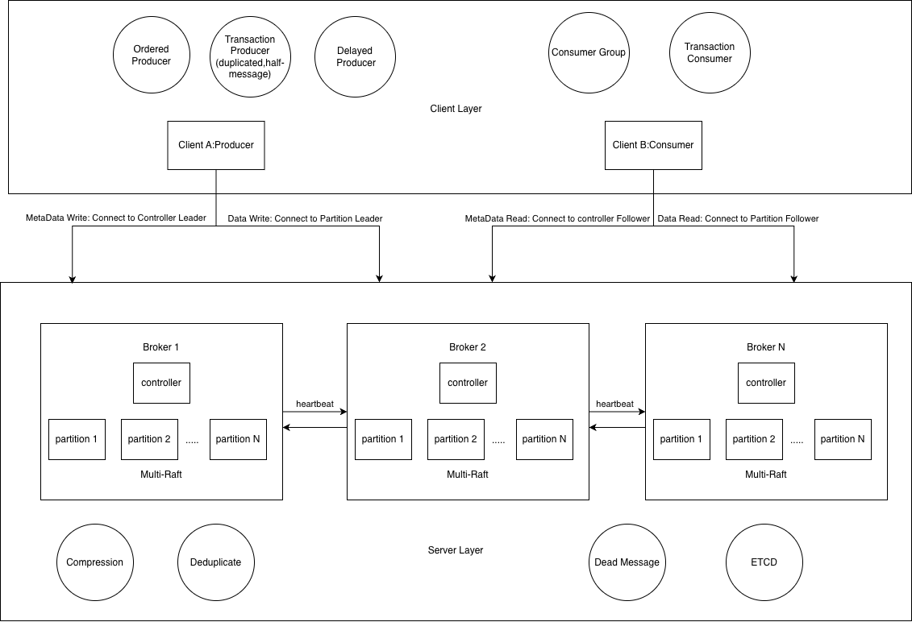

整体架构如图

客户端通过TCP连接Broker

# TODO list
1.controller分离架构，非每一台broker都要参与竞选
2.完善测试
3.use round robin to select broker
4.证明客户端缓存Raft信息、topic信息正确性
5.Raft groupID、TxnID有没有能保证唯一ID的方法，哈希冲突怎么办？
6.是否每次commit都要提交offset，其他消息队列是怎么做的 
# 使用方式
请参考 USAGE_GUIDE.md

# 实现
## 网络
使用TCP连接Broker，优化长连接，使用连接池
Producer 支持Async  IO
Consumer 支持 poll模式

## delay message
## dlq
## 
## exact-once
### producer
以下两种方法都能实现producer的exact-once
1.依靠sequence number实现，由于每个producer都会有唯一的producerID以及原子改变的seq，因此只需要判断producerID+seq，就可以判断消息是否重复

2.类似于kafka的half message，来实现本地事务，每次Producer首先发送的是半消息，半消息在Producer主动提交或Broker超时回查后选择提交为正式消息或回滚。这需要Producer发送信息前先生成txnID并开启事务，提供回查接口并监听，在halfMessage超时后决定回滚或提交

a.首先生成事务ID，
b.向broker发送half message，存储到broker的pebbleDB，同时写入时间索引供后续过期查询
c.执行本地事务，根据事务完成情况决定提交/回滚 half message
d.本地事务迟迟未返回，broker根据事务ID查询过期的half message，回查本地事务状态
### Consumer事务
客户端需提供三种handler: 1.处理消息handler 2.回滚Handler 3.提交Handler
若处理消息handler包含了超时回滚/提交操作，则回滚Handler/提交Handler可以省略

1.首先开启事务，新建客户端pebbleDB，将事务中消费的message统一存储在本地pebbleDB中，防止一条消息被消费多次
2.poll message，首先执行去重，防止服务端重启导致的消息回环
3.客户端执行本地事务（例如消费数据库，减少库存等操作）
4.为了最大限度的实现exact-once，即即使一个consumer崩溃后，另一个consumer也能继续实现consumeronce。因此我们将offset存储至broker，本地事务完成后，调用CommitTransaction完成后复用consumerGroup的offset信息，向Broker写入Offset信息。同时调用提交Handler
5.若提交事务失败，重试，否则调用回滚Handler

